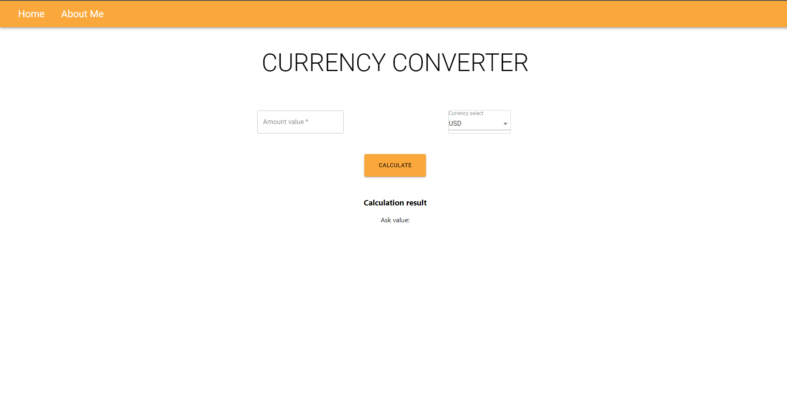
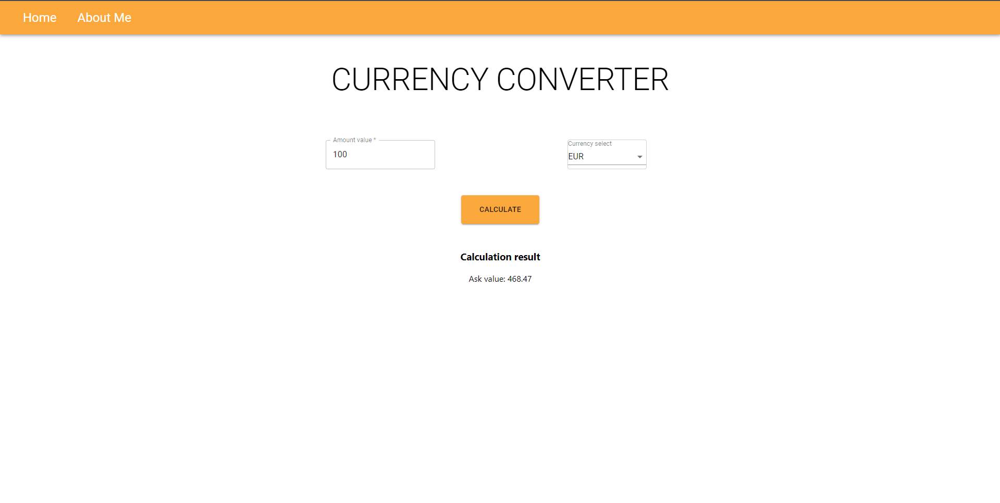

# CURRENT CALCULATION APPLICATION

This is simple **currency calculator** with two pages **Home** and **About Me**.
Layout for pages was created with **Material UI**.

Technology I used are **React.JS** and for change pages **React Router**.

Project has **one function** - **selecting a value multiplying by the current converted currency sell rate and show results**.
Currency value is downloading from NBP api with today's date.

If you want to use this application you must follow after bellow commands:

**`npm install`**
To install node_modules write this command.
This command would install whole dependencies.

**`npm start`**
Runs the app in the development mode.
Open [http://localhost:3000](http://localhost:3000) to view it in the browser.
The page will reload if you make edits.
You will also see any lint errors in the console.

### HOMEPAGE

### SHOW HOW WORKS CONVERTER

### ABOUT ME AND SOME COMMENTS SECTION

### PAGE ABOUT ME

